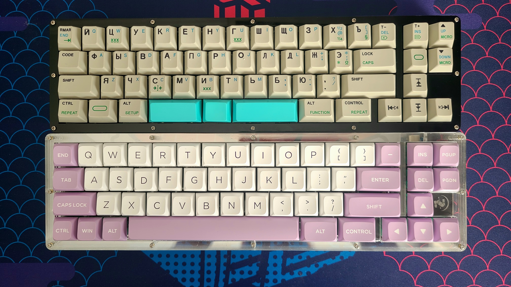
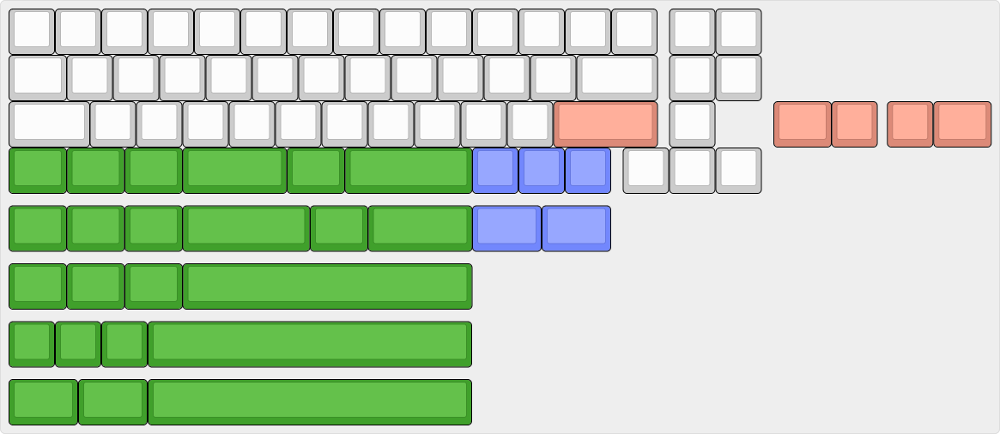

# Hubble
**ProMicro based 40% keyboard for with nav cluster, underglow and cyrillic layout support**

___
## PCB

___
## Layout

___
## Bill of material (BOM)

| Part                    | Count                   | Comment                                                        |
|-------------------------|-------------------------|----------------------------------------------------------------|
| ProMicro                | 1                       |                                                                |
| ProMicro socket         | 1                       | Optional, but recomended. You can find more info about sockets [here](https://www.40percent.club/2018/03/sockets.html)        |
| Diode 1n4148            | 57                      | You can use DO35 or SOD123. 1n5819 also works fine             |
| LED WS2812B 5050        | 7                       | Optional for ungerglow                                   |
| MX Switch               | 52-57                   | Depends on chosen layout                                       |
| PCB mount stabilizers   | 1-3                     | Depends on chosen layout                                       |
___
## Production Files

You can always find all production files in releases

___
## [Lasercut Acrylic Case](./acrylic-case)
___

## License

This project is licensed under a
[Creative Commons Attribution-NonCommercial-ShareAlike 4.0 International License][cc-by-nc-sa].

This license mean that you can repeat the project by yourself, modify the files, or use them as the basis for your own project.

To use the files for commercial purposes, please, contact me.

[![CC BY-NC-SA 4.0][cc-by-nc-sa-image]][cc-by-nc-sa]

[cc-by-nc-sa]: http://creativecommons.org/licenses/by-nc-sa/4.0/
[cc-by-nc-sa-image]: https://licensebuttons.net/l/by-nc-sa/4.0/88x31.png
[cc-by-nc-sa-shield]: https://img.shields.io/badge/License-CC%20BY--NC--SA%204.0-lightgrey.svg